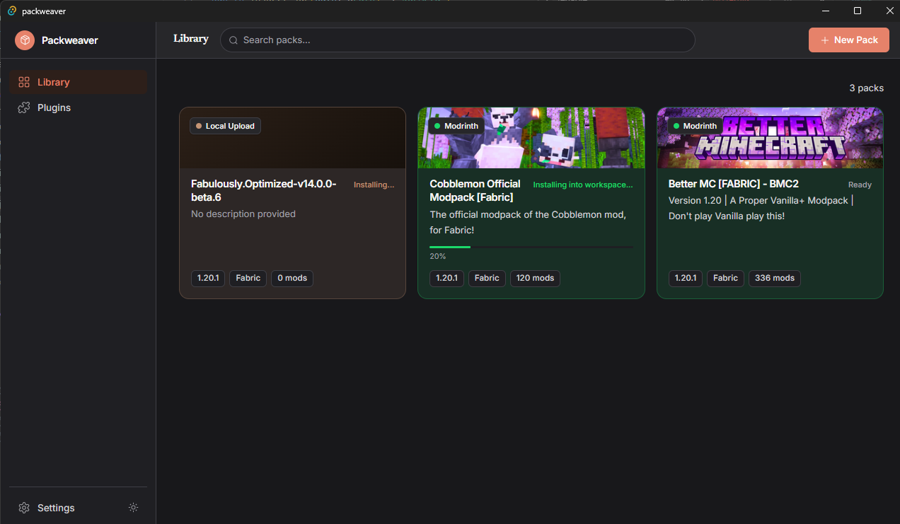
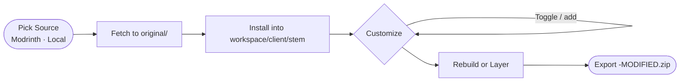

# Packweaver

> A desktop modpack builder for Minecraft — create, customize, and export modpacks from multiple sources.



Packweaver is a [Tauri](https://tauri.app) app (Rust + React + TypeScript) that lets you build Minecraft modpacks by picking a base pack from Modrinth or a local file, layering in your own custom mods, and exporting a client `.zip`. It is a **builder/exporter**, not a launcher — play stays in tools like Prism; a future “install into …” exporter is optional and far out.

**Platform:** Windows only (other OS targets are not supported or tested).

---

## What it does

1. **Create an Instance** — pick a base modpack from Modrinth or a local `.mrpack`/`.zip`. Packweaver **installs** it into `workspace/client/{stem}/` (Minecraft-shaped, not a raw archive dump).
2. **Customize** — add custom mods; toggle base or custom mods on/off (off = jar removed from that side’s tree).
3. **Rebuild** — wipe `workspace/client/`, reinstall the base pack under `{stem}/`, re-layer enabled customs (repairs messy instances).
4. **Export** — zip `workspace/client/{stem}/` as `{stem}-MODIFIED.zip`. With **Server Pack Packager** enabled: rebuild `workspace/server/{stem}/` and export `-MODIFIED-server.zip`.

`.mrpack` exporter is not available yet.

---

## Pipeline



Per-instance layout:

```text
instances/{id}/
  original/{realFilename}.mrpack
  workspace/
    client/{stem}/        # client — enabled content only
      mods/
      config/
      ...
    server/{stem}/        # server — when Server Pack Packager plugin is on
      mods/
      ...
```

---

## Tech stack

| Layer           | Tech                          |
| --------------- | ----------------------------- |
| Desktop shell   | [Tauri v2](https://tauri.app) |
| Backend         | Rust                          |
| Frontend        | React 19 + TypeScript + Vite  |
| Database        | SQLite via `rusqlite`         |
| HTTP            | `reqwest` (async)             |
| Modpack sources | Modrinth API, local files     |

---

## Project structure

```text
public/                 # Static assets (README screenshot, plugin icons)
src/                    # React frontend
  components/           # UI components
  plugins/              # Source + exporter plugins
    modrinth.ts         # Modrinth search & version fetching
    exporters/          # mrpack, zip, server exporters
  types/                # Shared TypeScript types

src-tauri/              # Rust backend
  src/
    lib.rs              # Tauri commands
    downloader.rs       # Install/rebuild + custom layer + zip
    installer.rs        # mrpack → Minecraft-shaped workspace
    fetchers.rs         # BasePackFetcher trait (Modrinth, Local)
    db.rs               # SQLite init & additive column upgrades
    models.rs           # Rust structs
    jar_inspector.rs    # Reads mod metadata from .jar / .zip
```

---

## Getting started

**Prerequisites:** [Rust](https://rustup.rs), [Node.js](https://nodejs.org), [pnpm](https://pnpm.io)

```bash
# Install dependencies
pnpm install

# Run in development
pnpm tauri dev

# Build for production
pnpm tauri build
```

---

## Domain model

| Term                | Meaning                                                   |
| ------------------- | --------------------------------------------------------- |
| **Instance**        | A workspace built on top of a Base Pack                   |
| **Base Pack**       | The modpack used as the foundation (e.g. a Modrinth pack) |
| **Platform Source** | Where the Base Pack comes from (Modrinth, local)          |
| **Base Mod**        | A mod inherited from the Base Pack                        |
| **Custom Mod**      | A mod added manually by the user on top of the Base Pack  |
| **Enabled**         | Whether a mod is included in the exported output          |
