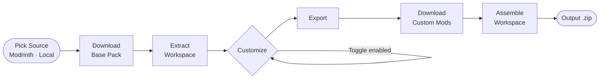

# Packweaver

> A desktop modpack builder for Minecraft — create, customize, and export modpacks from multiple sources.

Packweaver is a [Tauri](https://tauri.app) app (Rust + React + TypeScript) that lets you build Minecraft modpacks by picking a base pack from Modrinth or a local file, layering in your own custom mods, and exporting a client `.zip`.

**Platform:** Windows only (other OS targets are not supported or tested).

---

## What it does

1. **Create an Instance** — pick a base modpack from Modrinth or a local `.mrpack`/`.zip` file.
2. **Customize** — add your own mods (from Modrinth) on top of the base pack. Toggle custom mods on/off without deleting them.
3. **Export** — download custom mods, assemble the workspace, and package a client `.zip` (save dialog).

`.mrpack` / server-pack exporters and the Server Files tab are not available yet.

---

## Pipeline



See [`CONTEXT.md`](./CONTEXT.md) for domain terminology (Instance, Base Pack, Custom Mod, etc.).

---

## Tech stack

| Layer | Tech |
|---|---|
| Desktop shell | [Tauri v2](https://tauri.app) |
| Backend | Rust |
| Frontend | React 19 + TypeScript + Vite |
| Database | SQLite via `rusqlite` |
| HTTP | `reqwest` (async) |
| Modpack sources | Modrinth API, local files |

---

## Project structure

```text
src/                    # React frontend
  components/           # UI components
  plugins/              # Source + exporter plugins
    modrinth.ts         # Modrinth search & version fetching
    exporters/          # mrpack, zip, server exporters
  types/                # Shared TypeScript types

src-tauri/              # Rust backend
  src/
    lib.rs              # Tauri commands (get_instances, create_instance, etc.)
    downloader.rs       # Base pack download & extraction pipeline
    fetchers.rs         # BasePackFetcher trait (Modrinth, Local)
    db.rs               # SQLite init & migrations
    models.rs           # Rust structs (Instance, InstanceMod, ServerFile)
    jar_inspector.rs    # Reads mod metadata from .jar / .zip files
```

---

## Getting started

**Prerequisites:** [Rust](https://rustup.rs), [Node.js](https://nodejs.org), [pnpm](https://pnpm.io)

```bash
# Install dependencies
pnpm install

# Run in development
pnpm tauri dev

# Build for production
pnpm tauri build
```

---

## Domain model

| Term | Meaning |
|---|---|
| **Instance** | A workspace built on top of a Base Pack |
| **Base Pack** | The modpack used as the foundation (e.g. a Modrinth pack) |
| **Platform Source** | Where the Base Pack comes from (Modrinth, local) |
| **Base Mod** | A mod inherited from the Base Pack |
| **Custom Mod** | A mod added manually by the user on top of the Base Pack |
| **Enabled** | Whether a mod is included in the exported output |

Full glossary in [`CONTEXT.md`](./CONTEXT.md).
